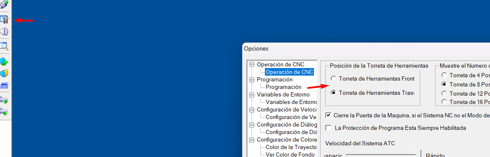
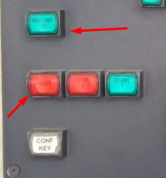
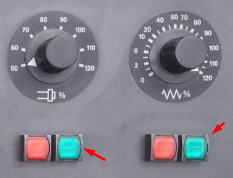
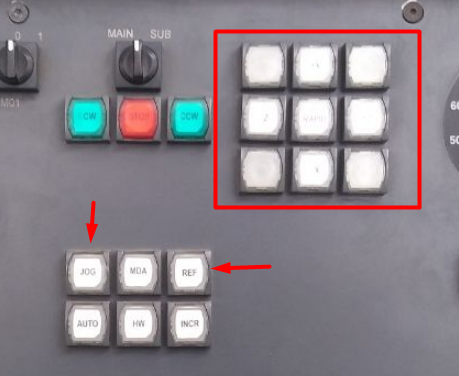
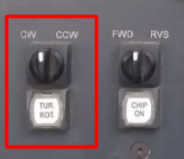
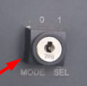
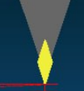
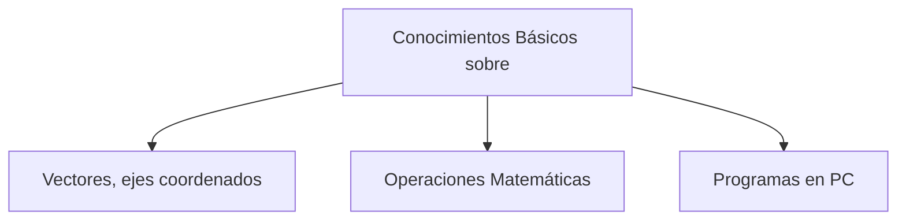
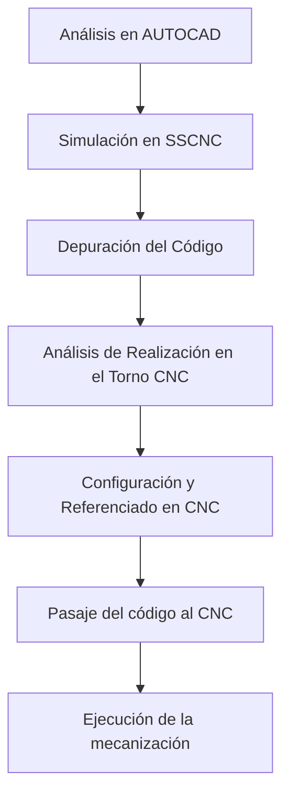

- [[#Peligros y Precauciones :LiSkull:|Peligros y Precauciones :LiSkull:]]
- [[#Introducción|Introducción]]
- [[#Requisitos de Cursada|Requisitos de Cursada]]
- [[#Objetivos de la Materia|Objetivos de la Materia]]
- [[#Metodología|Metodología]]
- [[#Trabajos Prácticos|Trabajos Prácticos]]
	- [[#Trabajos Prácticos#Alumnos Avanzados|Alumnos Avanzados]]
- [[#Simulador SSCNC|Simulador SSCNC]]
	- [[#Simulador SSCNC#Aclaraciones|Aclaraciones]]
	- [[#Simulador SSCNC#Errores comunes|Errores comunes]]
- [[#Evaluaciones|Evaluaciones]]
- [[#Sinumerik 802 DT "Control Númerico"|Sinumerik 802 DT "Control Númerico"]]
	- [[#Sinumerik 802 DT "Control Númerico"#Consideraciones|Consideraciones]]
	- [[#Sinumerik 802 DT "Control Númerico"#Programación y Simulación|Programación y Simulación]]
		- [[#Programación y Simulación#Simular|Simular]]
		- [[#Programación y Simulación#Ejecución del programa|Ejecución del programa]]
	- [[#Sinumerik 802 DT "Control Númerico"#Referenciar, el paso clave.|Referenciar, el paso clave.]]
	- [[#Sinumerik 802 DT "Control Númerico"#La mejor manera de referenciar|La mejor manera de referenciar]]
- [[#Piezas Chuck y Quill|Piezas Chuck y Quill]]
- [[#RS232|RS232]]
- [[#Programación - General|Programación - General]]
- [[#Resumen|Resumen]]


# Peligros y Precauciones :LiSkull:

+ Esta sección aparece al principio del documento, ya que aquí se dan los consejos para evitar accidentes.

1. Siempre simular antes de ejecutar cualquier código. Tener especial cuidado con la perilla **PRT**. En ocasiones poco frecuentes si se inicia la máquina con esta activada puede provocar que la simulación emita movimientos de la torreta. **Siempre Iniciar el CNC con PRT, desactivado en 0. Girado hacía la izquierda.**

<div style=" background-color: red; color: white; font-size: 2em; font-weight: bold; text-align: center; padding: 20px; border: 5px solid darkred; border-radius: 10px; text-shadow: 2px 2px 0 red; box-shadow: 5px 5px 15px rgba(0, 0, 0, 0.5); width: 50%; margin: 50px auto; font-family: Arial, sans-serif;"> ¡PELIGRO MÁXIMO! G54, G54... G59 </div>

Al ser ejecutado un programa como por ejemplo

```G-CODE
G96 S120 F0.15 M3 LIMS=2000
G54
T6M16
M30
```

El decalaje de origen G54, va a posicionar la herramienta en el punto de referenciado. *El problema es que*, como primero ejecutamos G54 en este código a pesar de no existir ningún indicio de un *G0*, la torreta se va a mandar a máxima velocidad $F \approx 33.000 mm/rev$ y no vamos a tener prácticamente oportunidad de reacción, si no tenemos la mano sobre la parada de emergencia.

Esta programación existe cuando referenciamos con decalaje de origen. Ocurre con el inserto "punta de diamante". Pero a pesar de no indicar ningún movimiento al herramienta busca ubicarse en el *0,0*. 

Por lo tanto a pesar de que solo queremos cambiar de herramienta, este es el objetivo de un código así, podemos terminar con resultados pésimos por un comportamiento de la máquina, que ante no tener un lugar para ir por defecto simplemente se choca. Por lo tanto agregar un G1 con movimientos en Z, sería lo más seguro ya que tendremos tiempo a reaccionar si empieza a moverse. 

**En el manual no existe ninguna referencia a este comportamiento, pero es un posible error.** *En la búsqueda de cambiar a la herramienta T6 con su registro G54 podemos obtener este comportamiento no deseado.*


Lo cual termina en:

+ Rotura del inserto que se mueva.
+ Daños en el porta inserto.
+ Marcaje o destrucción de la pieza.


---
# Introducción
El módulo del taller **Control Numérico y Computarizado** tiene como enfoque conseguir que los alumnos se familiaricen con el sistema de programación del torno CNC que está alojado en el taller. Esto mediante trabajos prácticos, un simulador y finalmente entrando en contacto con la máquina.
# Requisitos de Cursada

- Obtener un porcentaje de 80% o más de asistencia para dar por aprobada la asignatura.
- Aprobar y entregar el 80% de los trabajos prácticos.
- Aprobar la evaluación o su respectivo recuperatorio.
- Demostrar que tiene dominio del simulador. Esto debido a que disponemos de 6 computadoras para 12 alumnos o más por clase. Lo que puede provocar que solo trabaje en uno de los integrantes del grupo. **El simulador es prácticamente el torno con mínimas diferencias**. El simulador permite equivocarse, esta es una gran ventaja.
- Mostrar una actitud comprometida y acorde al contexto del taller. Mostrando respeto por sus compañeros, todas las personas que compartan espacio en el taller y el docente.

# Objetivos de la Materia

- Conseguir que los alumnos aprendan la lógica de programación del torno.
- Que los alumnos puedan proponer y simular una pieza a mecanizar, realizable. Tanto en un sentido práctico como en seguimiento a los valores de la institución (es decir nada que pueda resultar ofensivo, dígase referido a lo bélico o indecente).
- De todos los proyectos realizados por trimestre (uniendo a las 2 mitades de los cursos), conseguir mecanizar una pieza elegida por votación entre los mismos alumnos. Quedando totalmente descartados los auto votos. *Se dividen 2 grupos de alumnos por trimestre*.
- ***Si el alumno demuestra facilidad en la materia y avanza muy rápido, introducirlo al lenguaje de programación Python, por su simplicidad.*** **Esto con la finalidad de poder avanzar hacía los bucles que permite efectuar la máquina.** *O bien directamente explicar como funcionan los bucles en el simulador*.

# Metodología

1. Mediante el uso AUTOCAD, visualizar la mecanización de las piezas.
2. Mediante el uso de simuladores comprobar los códigos realizados de forma escrita o digital mediante la PC.
3. Demostrar el funcionamiento de lo realizado en la máquina.
# Trabajos Prácticos

La materia dispone de 5 trabajos prácticos.
1. El primer trabajo práctico tiene un enfoque mucho más teórico e introductorio, con un primer punto práctico que busca entender el concepto de mecanización de una forma más visual que por código.
2. El segundo trabajo práctico busca familiarizar al alumno con el manual y los comandos de programación. Y realizar la primera programación a partir de la primera pieza.
3. El tercer práctico ya busca a los alumnos un desafío el cual es realizar la programación de una pieza a través de otorgar el contorno o silueta de una pieza. *Acá se utilizó un simulador de celular Free CNC APK (Pero le suele generar confusiones, ya que memorizan los comandos y los mezclan)*.
4. Acá hay un stop intermedio entre TP3 y TP4. Para introducir a los alumnos al Simulador. El objetivo de este paso intermedio es que se realicen varias *pasadas*, para mecanizar las piezas de los prácticos anteriores.
5. En el cuarto trabajo práctico se aumenta el nivel de dificultad, se agregan comandos de interpolación circular G2 y G3. 
6. El quinto trabajo práctico es igual al cuarto pero agrega en el simulador conceptos más avanzados, como por ejemplo hacer operaciones de perforación o drilling, rotación de la pieza, trabajo en múltiples archivos. 

Sin embargo es necesario contemplar: **Se debe agregar un trabajo práctico N°0 de manera tal de repasar AUTOCAD y también entender la diferencia entre coordenadas absolutas y relativas**. También hay que considerar que puede ser necesario detenerse a explicar algunas herramientas básicas de AUTOCAD, ya que no todos los alumnos van a recordar las herramientas que han usado, si lo hicieron. Por otro lado hay que aprovechar la posibilidad de generar 3D en AUTOCAD y utilizar la herramienta "Revolve o Revolución", de forma tal de generar el 3D de los contornos.

## Alumnos Avanzados

Evidentemente hay alumnos que consiguen los objetivos más rápido que otros, por lo tanto hay que contemplar esta situación para dar material extra a estos alumnos, de forma tal de aprovechar las clases. 

> Esto forma parte de la última sección de la materia y es opcional para los que estén más avanzados. Con la finalidad de aprovechar el tiempo y el potencial de los alumnos que demuestren facilidades. Por supuesto que esto sumara siempre a la nota final.

- Trabajo Práctico N°6: Más teórico orientado a la investigación de los porta-insertos y los insertos.  *Este práctico es opcional, el último práctico es más útil.* Depende de la situación y el criterio del docente.
- Trabajo Práctico N°7: Orientado a la programación con Python, buscando que los alumnos comprendan sentencias lógicas, variables y bucles. Porque esto es aplicable al torno y permite automatizar mediante código la mecanización de las piezas. `Otra opción es directamente explicar como funciona la programación condicionada en el simulador`.

+ **También se puede contemplar la posibilidad de que los alumnos más avanzados accedan a programar, pasando código al CNC y simulando**.
+ Otra idea es realizar operaciones de roscado por ejemplo, desde el simulador ya que con el torno esto no es posible. Lo anterior se debe a que existe un golpe que no permite la ejecución correcta de este tipo de operaciones.
# Simulador SSCNC

El simulador SSCNC, SwanSoft CNC, es una gran herramienta para el aprendizaje de los alumnos, ya que permite simular el CNC y otras máquinas, inclusive fresadores. Para el mismo existen varías guías. También disponemos de videos en YouTube grabados por el docente que escribió está guía, explicando las operaciones básicas.

1. Como agregar piezas y herramientas. Además su posterior edición.
2. Cómo configurar y referenciar la torreta. Lo mismo para el origen de la pieza.
3. Como codificar en el simulador.
4. Como corregir errores comunes en el programa. (Esto último es preferible indicarlo cuando ocurra, esto es más útil cuando surge).

## Aclaraciones
Si bien la configuración del Simulador se vuelve cada vez más trivial con la práctica, el objetivo es conseguir que el alumno se vuelva independiente de consultar al docente para conseguir la configuración, ya que esto forma parte del parcial final. Entonces se deben buscar estrategias didácticas para lograr este cometido.
## Errores comunes
1. Agregar radios sin números cuando sea usa G2 y G3 en el código. Al ejecutar el programa se rompe y no se puede abrir más. La solución es buscar el archivo en la ruta donde se encuentra el programa y el código. Esto está en la siguiente ruta: ``C:\Nanjing Swansoft\SSCNC\SINUMERIK\802DT\SIEMENS`
   *Esto último puede variar en función de donde esté instalado el programa*.
```ISO
G2 X10 Z-50 CR= ; Esto rompe el programa por ejemplo
```
2. Intentar referenciar a la vez por Tool Measure y Workpiece Measure. Se consideran las referencias entre si y obtenemos un valor incorrecto. Es decir si referenciamos por Tool Measure está se considera a la hora de referenciar por Workpiece y nos da la superposición entre estos valores. *En otras palabras una referencia considera a la otra y la referencia finalmente queda mal.*

   *Notar que esta práctica puede ser útil en el torno si hace con criterio*
	`Esto pasa con la T6 del torno, "punta de diamante" desde tool measure solo permite referenciar en X, para referenciar en Z uso MeasureWorkPiece... Aunque podría hacerlo directamente todo por registro [G54-G59]!`
	
3. Olvidan algunos de los pasos iniciales como activar y desactivar la parada de emergencia. Por defecto la interfaz gráfica del programa debería mostrar el botón en gris, ya que es la forma en la que debe iniciarse el torno, pero no lo hace. Entonces hay que activar y desactivar la parada de emergencia para solucionar este error del programa. 
4. Accidentalmente se borra el registro de la herramienta, esto se debe crear nuevamente en Offset Param y en la lista de las herramientas.  El error provoca que en el momento de referenciar por herramienta, se muestre un cartel de error con el mismo en blanco.
5. Colocar la herramienta del torno por debajo, esto se arregla modificando los parámetros de configuración modificando la opción de la posición de la torreta.

6. Tratar de utilizar varios programas a la vez como AUTOCAD, WORD, Obsidian y el simulador a la vez. Esto provoca que por falta de memoria el programa se cuelgue. Tener en cuenta que la capacidad de las computadoras es relativamente obsoleta entonces no es raro quedarse sin memoria RAM.
7. Desactivar la vista de las líneas del programa, deshabilitar la visualización de la torreta, de la pieza. Esto se soluciona buscando en las opciones de visualización y buscando a que opción corresponde cada elemento.

# Evaluaciones

+ La evaluación busca que los alumnos estén preparados para programar en cualquiera de sus formas G90, G91, DIAMON, DIAMOF. (En un principio se elige una de las formas al azar por tema, con la idea de que deban conocer todas las formas para programar. *También podría tomarse G90 y G91*. **En caso de ir a recuperatorio si que se toma el modo alternativo**)
	+ Esto anterior realizando el contorno de la pieza.
+ Preguntas Teóricas 2 idénticas a los prácticos más 1 o 2 de sentido común si han usado el simulador.

# Sinumerik 802 DT "Control Númerico"

## Consideraciones
Al adquirir práctica con el simulador realizando los distintos ejercicios, se pueden empezar a hacer paralelismos con el simulador. 

**Asegurarse de que la parada de Emergencia este activada antes de prender la máquina. Presionar hacia abajo hasta el "clack", sin demasiada fuerza. Si no pasa nada ya está activada.**

*Cuando se termine de encender el CNC:*
+ Desactivamos la parada de emergencia rotando la palanca suavemente de un lado hacía el otro.
+ Para iniciar el torno debemos dar en el botón de Machine On, Reset y Luego Machine On.

+ Debemos habilitar el movimiento en la torreta y en el plato activando el movimiento con los botones correspondientes: 

+ Debemos referenciar la torreta, automáticamente el Torno se coloca en modo JOG REF, con estos botones en azul damos primero en "+X" y luego "+Z".  **Considerar que la torreta no se encuentre en un lugar comprometido, ya que podría chocarse con obstáculos**. Se recomienda referenciar en X primero ya que en Z existen más elementos intermedios cómo la contra-punta.

+ Debemos referenciar la torreta, dando en el botón TOR ROT. Esto hará que la torreta gire y quede la primera herramienta seleccionada.


*Una vez realizadas todas estas configuraciones iniciales ya podemos utilizar la máquina sin ningún problema*.

## Programación y Simulación

*Considerar que antes de efectuar la ejecución de un programa, debe verificarse que la referencia se haya realizado de forma correcta.*

Para programar debemos ir a la sección de Program Manager y abrir un archivo o crear un nuevo desde acá podemos programar sin ningún problema. 
### Simular
*Pero si queremos simular, tendremos que utilizar la llave para conseguir activar el modo de simulación.* Cambiando el modo de 0 a 1.

**Tener cuidado ya que podría darse la situación donde la torreta se mueva por un error de la máquina, ha ocurrido en pocas ocasiones. Pero esto no quiere decir que no vuelva ocurrir**. ***Lo que si pasa es que se cambia la herramienta, pero eso no es mayor problema si la torreta está en su origen!***. La situación en la que ocurrió fue cuando todos los Switches se encontraban activado, en especial el modo PRT. *Este en una versión especial del manual aparece como: Program processing without axis movements*

> Es recomendable siempre dejar la torreta en su posición de origen. Esto es cuando efectuamos la referencia y tenemos el "0" máquina. Que es la posición de referencia de la torreta.

Por lo anterior se recomienda arrancar la primera simulación con un comando G1, para tener tiempo de reacción si es que la simulación provoca un movimiento de la torreta.  Lo que si ocurre es que si se cambia de herramienta, la torreta gira y se selecciona la herramienta de ese código para realizar la simulación, siendo este el único movimiento normal a la hora de realizar la simulación.

En caso de ver que se mueve se puede activar la parada de emergencia o se puede pulsar el botón de STOP. *Los movimientos de este tipo han sido detectados cuando por ejemplo PRT está en 1.*

### Ejecución del programa

Para la ejecución del programa [[#Referenciar, el paso clave.|la referencia]], es fundamental. La simulación puede estar perfecta pero si no definimos bien nuestro origen, no obtendremos el resultado deseado y además corremos el riesgo de dañar la máquina.

+ Una vez asegurada la referencia con un pequeño programa de verificación:
	1. Pasamos al modo AUTO.
	2. Damos a ejecutar en la pantalla del programa.
	3. Activamos el Modo SEL con la llave del torno.
	
	4. Esperamos.
*Se recomienda hacer las primeras pasadas en modo Single Block, para ejecutar poco a poco cada línea. Con la finalidad de evitar múltiples golpes si ocurren.*
## Referenciar, el paso clave.

Esto depende del tipo de inserto que utilicemos en general nos movemos manualmente con el "piloto". El piloto nos permite movernos en X o en Z, un eje a la vez. 

Nuestro objetivo es acercarnos al borde de la pieza tal como se realiza con el posicionamiento rápido en el simulador. A la hora de referenciar de está forma tendremos un error de milésimas o un par de milímetros dependiendo de nuestra habilidad visual. Evitar el error de paralaje, posicionarse lo más paralelo que se pueda a la pieza y el inserto, sobre el plano.

Debemos intentar referenciar por Tool Measure siempre tanto en X, cómo en Z.

Si no podemos referenciar podemos pasar a Measure WorkPiece, o referenciar uno de estos ejes de está forma.

> Esto ocurre con una de las herramientas en particular la T6 o la punta de diamante, solo nos permite referenciar X con Tool Measure. Por lo tanto para referenciar el otro eje podemos utilizar Measure WorkPiece, entonces referenciamos Z con Measure WorkPiece.


Inserto Triangular de Terminado.
## La mejor manera de referenciar

+ Tal como muestra Gali en su demostración se puede referenciar X cilindrando y tomando el valor del diámetro con calibre (Esto también tiene error por la medición del calibre y del operador, aunque sean unas pocas milésimas). Guardando la posición, sumado al nuevo diámetro de la pieza luego de cilindrar.
+ Referenciar Z haciendo un ""Frentiado"" de la pieza y después guardando esa posición. Esta operación evidentemente si es mejor, ya que esto crea un nuevo plano directamente.

# Piezas Chuck y Quill

El CNC dispone de 2 pedaleras las cuales suelen estar debajo del CNC para evitar que los alumnos se pongan a jugar con ellas. Las mismas tienen 2 funciones, activar/desactivar ajuste de la abrazadera o activar/desactivar la contra-punta. La cual en su estado por default tolera como máximo 30mm de diámetro máximo, es decir una pieza de mayor diámetro no podrá ser sujetada, en la forma por defecto. **No se recomienda trabajar fuera de la forma por defecto por seguridad**.

Esto en el panel del CNC corresponde a la tecla ***CHUCK***. Al presionar por primera vez se liberan las abrazaderas, al hacerlo nuevamente se presiona nuevamente.

Hay que entender también que debajo a la izquierda disponemos de 2 ajustes tipo perilla los cuales permiten ajustar la presión del CHUCK y el QUILL.

> ¿ Que ocurre si al presionar Quill, no tenemos movimiento?. Posiblemente le falte presión esto se consigue aumentar con las perillas que se encuentran en la esquina inferior izquierda del CNC, que tienen dos lectores analógicos que indican la presión.

**QUILL**, es por otro lado la activación de la contra-punta. Esta se activa de forma automática y sale o se esconde. Antes de usarla hay que tener la pieza preparada con una perforación para tener un punto de apoyo disponible. 

*¿Porqué usar la contra-punta?* : Cuando dispongamos de una pieza muy larga y de considerable diámetro, a la hora de mecanizar tendremos vibraciones sobre la pieza producto del largo. Esto último debido a que no es suficiente con la fuerza de la abrazadera para mantener la pieza totalmente estable. Por lo tanto agregando la contra-punta como ayuda podemos mejorar esta condición y trabajar sobre las piezas sin está problemática. 

*Detectaremos la necesidad de usar la contra-punta a la hora de cilindrar, notando ruidos que no ocurren en una mecanización normal*. También cuando terminemos de cilindrar notaremos rugosidad sobre la pieza.
# RS232

A través del cable RS232 se puede tanto extraer código del torno hacía la PC, como viceversa esto es clave debido a que ahorra mucho tiempo a la hora de pasar el código manualmente.

Para pasar el código es simple esto funciona casi que de forma inmediata y sin mayor problema. Lo importante es configurar correctamente la PC con la tasa de bits (bps) a de 19200 como esta trabajando el CNC.

Esto se observa tanto cuando nos dirigimos a PROGRAM MANAGER > LEER O EMITIR.

En la PC debemos configurar el puerto serial tanto en el programa WINPCIN. Como en el administrador de dispositivos de Windows, este se encuentra buscando en la barra de búsqueda de Windows o el panel de control. Desde acá hay que analizar las configuraciones y ver que sean similares. También se puede modificar el tipo de transferencia de dato.


**Lo que es fundamental para conseguir envíar información desde la PC hacía el CNC es** *Agregar el encabezado al archivo*

1. Debe contener el nombre del archivo en la primera línea de código `%_N_NombreArchivo_MPF`
2. El destino de copiado del archivo, por default es:
   `;$path=/N_MPF_DIR`

```ISO
%_N_ArchivoPrueba_MPF
;$path=/_N_MPF_DIR

G96 S120 F0.15 M3 G90 DIAMON
T1D1
G0 X0 Z5
G1 X0 Z0

; El resto del programa

M30
```

Siguiendo estos pasos y considerando también que el código puede ser mucho más extenso, se consigue transferir el código sin ningún tipo de problema.

**En donde está el programa WINPCIN?**: Si no está disponible en la PC del armario del módulo. Se encuentra en disponible en uno de los CD's que están adentro de la caja que contiene tanto CD's como un disco floppy. 


# Programación - General

A la hora de programar hay que tener en cuenta las siguientes cuestiones

**G96** : Es el modo de trabajo donde fijamos la velocidad de corte como constante, y esta la definimos con *S* que depende del contexto y al ser combinada con G96 se refiere a la velocidad de corte de la herramienta.

*G96 + S* = Velocidad de corte constante en la herramienta y acá **S** es el valor de la herramienta de corte la cual tiene las dimensiones *\[m/min\]* (Su rango está entre 120 - 180)

**G97**: Es el modo de trabajo donde mantenemos fija la velocidad de rotación del plato o el husillo, entonces **S** ahora es la velocidad de rotación del plato en rpm.

**F** : Es el avance el cual depende del tipo de material a mecanizar el aluminio fundido del taller se mecaniza con valores de entre 0.15 - 0.3 \[mm/min\].

**G90** : Es el modo con referencia fija o modo absoluto de programación, todos los puntos se miden respecto a una única referencia

**G91** : Es el modo con referencia variable o modo relativo/incremental de programación, todos los puntos se miden respecto al anterior, dando por resultado un código responsivo al punto anterior.

**DIAMON** : Activa las cotas en modo diámetro.

**DIAMOF** : Activa las cotas en modo radio.

**M3/M4** : Activa el giro del plato en sentido horario (M3) o en sentido antihorario (M4). Este comando es clave ya que sin el mismo, en el torno CNC obtenemos directamente error y en el simulador *SSCNC* colisionamos la herramienta.

**LIMS** : Se aplica siempre que estemos usando **G96** y es el limite de velocidad de giro del plato cuando nos acercamos a diámetros inferiores al diámetro donde se produce esta máxima velocidad. De está forma nos aseguramos de no pasar de revoluciones el plato. Su rango de valores es de 1500-3000 rpm. Considerar que este es el valor límite por lo tanto a mayores diámetros tendremos una velocidad de rotación menor.

**G0** : La interpolación lineal a máxima velocidad de la herramienta, este comando solo debe utilizarse para acercarse a la pieza y alejarse sin rozarla. Evitando usar este comando cuando aún no estemos seguro de si la referencia se ha ejecutado en la forma correcta.

**G1** : La interpolación lineal a la velocidad de avance F. Utilizada para mecanizaciones lineales, como chanfles, frenteados, cilindrados, escalonados y demás.

**G2 / G3** : La interpolación circular, ahora se realiza mecanizado pero en forma de curvas, para el uso de estos comandos se suele utilizar el radio.
# Resumen




